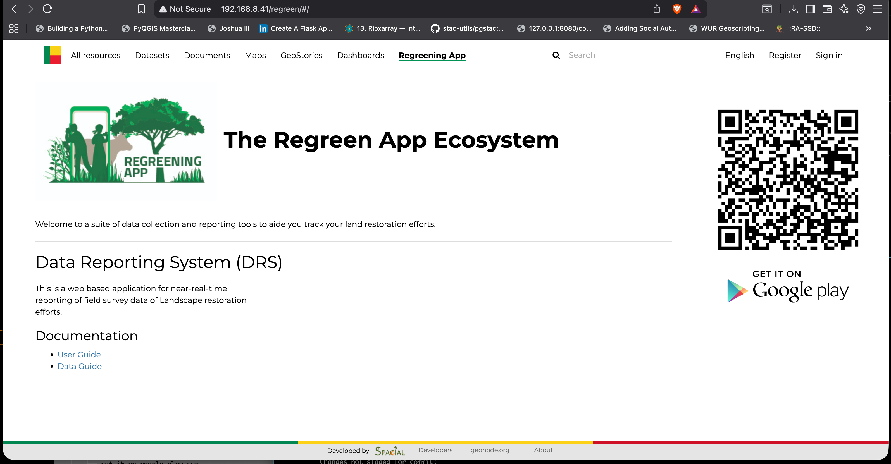

# Regreen App Ecosystem

BCGeo players were interested in using the regreening suite of data collection and reporting tools.

This need created a requirement to have new tab in the navbar, hence this app.

This app is added into the `src/geonode_project` folder (an app within the django project)


```bash
regreen/
├── apps.py
├── __init__.py
├── static
│   ├── img
│   │   ├── get-it-on-google-play.svg
│   │   ├── regreen_app_logo.png
│   │   └── RegreeningApp.jpeg
│   └── regreen
│       └── css
│           └── regreen.css
├── templates
│   └── regreen
│       └── index.html
├── urls.py
└── views.py

8 directories, 13 files
```

## prequisites

We will be working in `/src/geonode_project/`

Create the app root dir

```zsh
mkdir regreen

```

### Step 1. create main app file

```py title="app.py" linenums="1"
from django.apps import AppConfig


class CustomContentConfig(AppConfig):
    default_auto_field = "django.db.models.BigAutoField"
    name = "geonode_project.regreen"

```

### Step 2. Configure your routing

```py title="urls.py" linenums="1"
from django.urls import path

from . import views

app_name = "regreen"

urlpatterns = [
    path("", views.index, name="index"),
]

```

### Step 3. Handle request and give response to template


```py title="views.py" linenums="1"
from django.shortcuts import render


def index(request):
    return render(request, "regreen/index.html")

```
### Step 4. Your UI - Template

- create a templates folder and regreen folder respectively
```
mkdir templates

mkdir templates/regreen/
```

- create an index.html file in the regreen folder

```html title="index.html"







<div class="custom-content-page" style="display: flex;">

    <div class="container">

        <h1 style="font-size: 40px; font-weight: bold;">
            </img>
            The Regreen App Ecosystem
        </h1>
        <br>
        <p>
            Welcome to a suite of data collection and reporting tools to aide you track your land restoration efforts.
        </p>

        <hr>

        <h2 style="font-size: 30px; font-weight: semi-bold; margin-bottom: 20px;">Data Reporting System (DRS)</h2>

        <p>
            This is a web based application for near-real-time <br>
            reporting of field survey data of Landscape restoration <br>
            efforts.
        </p>

        <h2>Documentation</h2>

        <ul>
            <li>
                <a href=""
                   target="_blank">
                    User Guide
                </a>
            </li>

            <li>
                <a href=""
                   target="_blank">
                    Data Guide
                </a>
            </li>
        </ul>

    </div>
    <div style="display: flex; flex-direction: column; gap: -10px; margin-right: 30px;">
        </img>
        </img>
    </div>

</div>


```

### Step 5. add the custom app to installed apps 

in settings.py, register the custom app like

```python

INSTALLED_APPS += ("geonode_project.regreen",)

```
### Step 6. add the discovery link, of the app in navigation bar.

in `/geonode_project/templates/geonode-mapstore-client/snippets/brand_navbar.html` add a link to the app.

geonode uses the mapstore client as the frontend hence we add the app here like:

```html title="brand_navbar.html" linenums="17"
    <li>
        <a id="regreen-content"
           href="/regreen/"
           target=""
           class="nav-link btn btn-default">
            
        </a>
    </li>

```

??? info "Why add link here?"

    We are handling our translations of the navbar in this template.
    Therefore, for consistency we add the entry point to regreen app here.

### Step 7. register the location of the app in geonode project urls.py

this will add routing to the app from our geonode project like

```python
path("regreen/", include("geonode_project.regreen.urls")),
```

### Step 8. Build the django container again like:

```bash
docker compose up -d --build django
```

app looks like
